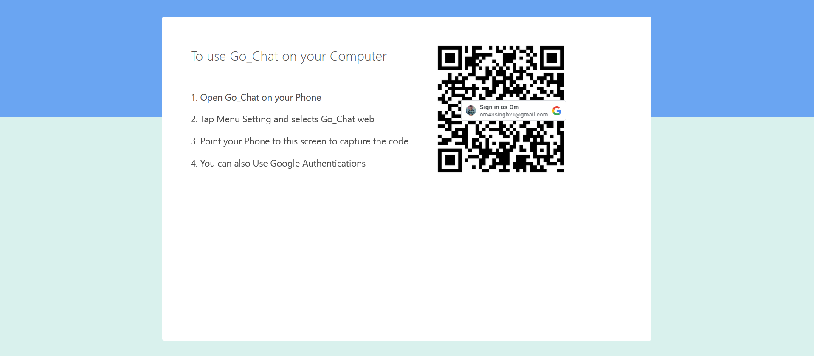
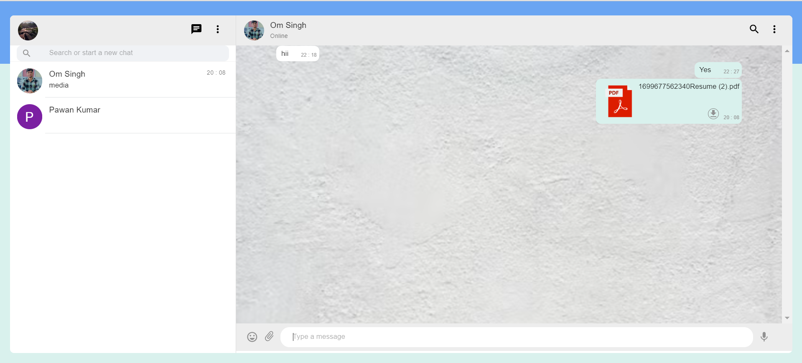

# INTRODUCTION

**Go_Chat** is an innovative messaging application designed to provide seamless and secure communication. Our platform offers real-time messaging, multimedia sharing, and end-to-end encryption, ensuring your conversations remain private and protected. With a user-friendly interface and a suite of robust features, Go_Chat guarantees a smooth and efficient chatting experience for all users.

## Key Features

### Secure Google Authentication
To ensure the security of our users, Go_Chat requires logging in via Google Authentication. This provides a secure and convenient way to access the application, leveraging Google's trusted authentication system.

### Real-Time Messaging and File Sharing
Go_Chat supports real-time messaging, allowing users to communicate instantly. In addition, users can share files, including images, documents, and videos, facilitating richer and more dynamic conversations.

### Advanced Data Encryption
Security is a top priority at Go_Chat. I implemented a custom data encryption algorithm to ensure the privacy of our users` communications. The encryption algorithm is based on Huffman Encoding, which I personally developed and integrated into the application. This algorithm encrypts messages before they are stored on our servers, providing robust protection against unauthorized access.

## Additional Functionalities

### User-Friendly Interface
Go_Chat is designed with a focus on user experience. The intuitive interface makes it easy for users of all ages to navigate and use the app effectively.

### Multimedia Sharing
Beyond text messages, users can share photos, videos, and other multimedia files, making conversations more engaging and expressive.

### Cross-Platform Compatibility
Go_Chat is compatible with multiple platforms, ensuring that you can stay connected whether you're on a desktop, tablet, or mobile device.

### Efficient Performance
This application is optimized for performance, providing fast and reliable messaging even under varying network conditions.

